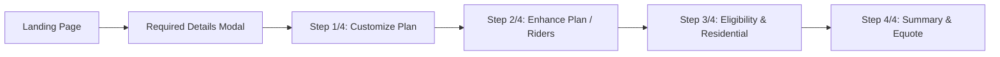

# Selenium Automation for Axis Max Life Insurance Portal

Automate the Axis Max Life premium calculator portal end-to-end with test data from `test data/insurance_test_data.xlsx`, downloading Benefit Illustration PDFs, extracting and comparing Equote Number & Premium values, and producing a final CSV/XLSX report.

## Portal Flow (Discovered via Exploration)

The portal has **4 main steps** plus a landing page and a modal:

### Page-by-Page Field Mapping

| Page | Field | Source | Selector |
|------|-------|--------|----------|
| **Landing** | Full Name | Test Data | `input#fullName` |
| **Landing** | Date of Birth | Test Data (DDMMYYYY) | `input#dob` |
| **Landing** | NRI Status | Always "No" | Radio button label text |
| **Landing** | Mobile Number | Test Data | `input#mobile` |
| **Landing** | Annual Income | Test Data (map to range) | Radio button label text |
| **Landing** | → Submit | — | `button#viewPlans` |
| **Modal** | Gender | Test Data | Button text: Male/Female |
| **Modal** | Tobacco/Nicotine | Always "No" | Button text |
| **Modal** | Language | Always "English" | Button text |
| **Modal** | Occupation | Test Data | Button text |
| **Modal** | Education | Test Data | Button text |
| **Modal** | Diabetic | Always "No" | Button text |
| **Modal** | Marital Status | Always "Single" | Button text |
| **Modal** | → Submit | — | "Check Coverage" button |
| **Step 1/4** | Life Cover | Test Data | Currency input |
| **Step 1/4** | Cover Till Age | Test Data | Radio button |
| **Step 1/4** | → Proceed | — | `button#viewPlans` |
| **Step 2/4** | Critical Illness Rider | Test Data (Yes/No) | Checkbox |
| **Step 2/4** | → Skip/Proceed | — | `button#viewPlans` |
| **Step 3/4** | Email | Test Data | `input#email` |
| **Step 3/4** | Annual Income | Test Data (numeric) | `input#eligibilityAnnualIncome` |
| **Step 3/4** | Pincode | Test Data | `input#pincode` |
| **Step 3/4** | City | Always "Bangalore" | Dropdown after pincode |
| **Step 3/4** | Download Benefit Illustration | Click link | Link text |
| **Step 3/4** | → Proceed | — | `button#viewPlans` |
| **Step 4/4** | Equote Number | **Extract** | Page text |
| **Step 4/4** | Premium | **Extract** | Page text |

### Test Data Columns (from Excel)

| Column | Example |
|--------|---------|
| Full Name | Vikram Banerjee |
| Date of birth | 19/08/1982 |
| Mobile | 9069041652 |
| Annual income | 3,812,052 |
| Gender | Male |
| Occupation | Self Employed |
| Education | Grad or above |
| Life cover | 3 crore |
| Cover till age | 65 |
| Critical Illness Rider | No |
| email id | vikram.banerjee@gmail.com |
| Pincode | 560016 |

## Proposed Changes

### [NEW] [axis_max_life_automation.py](file:///c:/Users/SAIDEEP%20D.%20GAUNKER/Desktop/watermellon/axis_max_life_automation.py)

The main Selenium automation script with the following structure:

1. **Configuration & Setup**
   - Chrome WebDriver setup with download directory configuration
   - Headless mode option (default: headed for debugging)
   - Configurable wait timeouts
   - Download directory set to `./downloads/`

2. **Data Reader** (`read_test_data()`)
   - Read `test data/insurance_test_data.xlsx` using `openpyxl`
   - Parse and return first 6 rows as list of dicts
   - Map `Annual income` string to income bracket (e.g., "3,812,052" → "Above 20 Lakhs")

3. **Form Automation Functions** (one per page)
   - `fill_landing_page(driver, data)` — Name, DOB, NRI=No, Mobile, Income bracket
   - `fill_details_modal(driver, data)` — Gender, Tobacco=No, Language=English, Occupation, Education, Diabetic=No, Marital=Single
   - `fill_step1_customize(driver, data)` — Life Cover, Cover Till Age
   - `fill_step2_riders(driver, data)` — Critical Illness Rider toggle, Skip/Proceed
   - `fill_step3_eligibility(driver, data)` — Email, Annual Income, Pincode, City=Bangalore, Download Benefit Illustration
   - `extract_step4_summary(driver)` — Extract Equote Number & Premium

4. **PDF Comparison** (`compare_pdf_values()`)
   - Read downloaded Benefit Illustration PDF using `PyPDF2`
   - Extract Equote Number & Premium from PDF text
   - Compare with values extracted from Step 4/4

5. **Report Generator** (`generate_report()`)
   - Output CSV and XLSX files with columns: `Test Case ID`, `Name of Insurer`, `Equote Number`, `Premium`, `PDF Match Status`
   - Save to `./test_results/`

6. **Main Loop**
   - Iterate through first 6 test data rows
   - For each row: open fresh page → fill all steps → download PDF → extract values → compare → record results
   - Robust error handling with screenshot on failure

> [!IMPORTANT]
> **Annual Income Mapping Logic**: The landing page uses radio buttons with ranges (e.g., "5 - 10 Lakhs", "10 - 20 Lakhs", "20 - 50 Lakhs", "Above 50 Lakhs"). We need to map the exact numeric income from test data to the appropriate bracket.

### Income Bracket Mapping

| Income Range | Portal Bracket |
|-------------|---------------|
| < 5,00,000 | "< 5 Lakhs" |
| 5,00,000 - 10,00,000 | "5 - 10" |
| 10,00,000 - 20,00,000 | "10 - 20" |
| 20,00,000 - 50,00,000 | "20 - 50" |
| > 50,00,000 | "50+" |

## Open Questions

> [!IMPORTANT]
> 1. **Number of test rows**: You mentioned 5-6 rows. The Excel has 50+ rows. Should I use exactly the **first 6 rows** or would you prefer a different selection?
> 2. **Headed vs Headless mode**: Should the browser run visibly (headed) so you can watch, or in headless mode for speed?
> 3. **"Housewife" occupation**: Some test data rows have "Housewife" as occupation, but the portal only shows "Salaried" and "Self-employed". Should I map "Housewife" to "Self-employed", or skip those rows?

## Verification Plan

### Automated Tests
- Run the script with 1 test row first to validate the full flow
- Verify the downloaded PDF exists and contains expected data
- Verify the CSV/XLSX report is generated correctly

### Manual Verification
- Visual inspection of the generated report
- Spot-check one PDF download against portal values
